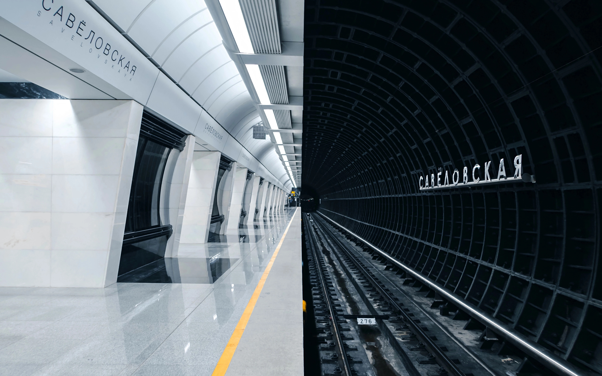

# dotfiles

A collection of config files and scripts that make my life easier and I don't want stuck on a thumbdrive anymore.


## $> terminal | [Alacritty](https://github.com/alacritty/alacritty)

### config files
1. Copy [terminal/*](terminal/) to ~/.config/alacritty
2. `unzip themes.zip`

### Prompt 

1. Copy [prompt/.git-prompt.sh](prompt/.git-prompt.sh) to `~`
2. `vim ~/.bashrc`

```bash 
# .bashrc
. ~/.git-prompt.sh

# prompt dir limit
PROMPT_DIRTRIM=2

PROMPT_COMMAND='PS1_CMD1=$(__git_ps1 " (%s)")'; PS1='\[\e[38;5;70;1m\]\u@\h\[\e[0m\]:\[\e[01;34m\]\w\[\e[0m\]\$\[\e[2m\]${PS1_CMD1}\[\e[0m\] '
```

## gnome config | Using pop_OS!

### gnome configuration import

`dconf load / < gnome-config/settings.conf`

### gnome shell extensions

`sudo apt install gnome-tweaks`

1. [horizontal-workspace-indicator@tty2.io](https://extensions.gnome.org/extension/3952/workspace-indicator/)
2. [transparent-top-bar@zhanghai.me](https://extensions.gnome.org/extension/1708/transparent-top-bar/)
3. [tunnel-monitor@drillchan.net](tunnel-monitor@drillchan.net/)

To Install my custom extension that can connect / disconnect and monitor an SSH tunnel in the topbar. 

1. `cp tunnel-monitor@drillchan.net ~/.local/share/gnome-shell/extensions`
2. Update lines 89, 89, and 120
3. `gnome-extensions enable tunnel-monitor@drillchan.net`

### Workspaces

**autostart** | Automatically launch software in designated workspace

1. `mkdir ~/.config/autostart`
2. copy [workspaces/workspace-setup.desktop](workspaces/workspace-setup.desktop) to `~/.config/autostart/`
3. modify the path accordingly
4. copy [workspaces/setup-workspaces.sh](workspaces/setup-workspaces.sh) to `~/.local/bin/setup-workspaces.sh`
5. `chmod +x ~/.local/bin/setup-workspaces.sh`
6. Install wmctrl `sudo apt update wmctrl`
7. Logout and Log Back in to test

## Wallpaper




## VSCode


```json
{
    "git.autofetch": true,
    "workbench.colorTheme": "Rosé Pine",
    "workbench.colorCustomizations": {
        "sideBar.border": "#524f67"
    },
    "git.confirmSync": false,
    "glassit.alpha": 255, // wanted transparancy option
    "github.copilot.nextEditSuggestions.enabled": false,
    "github.copilot.enable": {
        "*": false,
        "plaintext": false,
        "markdown": false,
        "scminput": false,
        "typescript": false
    },
    "[typescript]": {
        "editor.defaultFormatter": "esbenp.prettier-vscode"
    },
    "editor.tabSize": 2,
    "[markdown]": {
        "editor.defaultFormatter": "yzhang.markdown-all-in-one"
    },
```

## Guides
**[Guides and Documentation](guides/readme.md)**